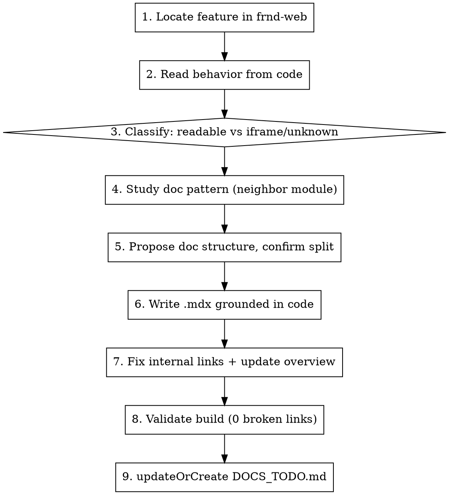

# Writing Help Center Docs from Code

## Overview

Turn a **feature keyword** into accurate end-user Help Center guides (`frndos-docs/docs/<module>/*.mdx`) by reading the real behavior out of the **frnd-web** codebase — not from memory, not from guessing.

**Core principle: every sentence in the doc must trace to something in the code, or be marked as a `TODO` for a human. Inventing UI steps, button names, or flows you did not read is the one failure this skill exists to prevent.**

The frndOS repos are the source of truth in this order:
1. **`frnd-web`** (`../frnd-web`) — PRIMARY. Routes, UI labels, buttons, tabs, gating, entry points all live here.
2. **`frnd-api-php`** (`../frnd-api-php`) — OPTIONAL. Only to confirm API field names or business rules when frnd-web is ambiguous.

**Ignore third-party iframes/vendors** (e.g. Populix survey builder). Code inside frnd-web stops at "open the iframe" — the steps inside are NOT in any repo. Mark them `TODO`, never guess.

## When to Use

- User gives a feature keyword and asks to create/update Help Center docs
- User says "document <feature> in the help center" / "buatkan docs untuk <fitur>"
- Adding or revising guides under `frndos-docs/docs/`

**When NOT to use:** changelog/blog "What's New" entries (different voice, `blog/`), or pure config/chrome edits (`config/*.json`).

## The Workflow



### 1. Locate the feature in frnd-web

Search from the keyword. High-signal sources:

```bash
cd ../frnd-web
# Routes = the feature map (URLs, sub-features)
find "src/app/(dashboard)" -type d -iname "*<keyword>*"
# Everything referencing it
grep -ril "<keyword>" src --include="*.tsx" --include="*.ts"
# Services (API surface), types (data shape), permissions/flags (gating)
grep -n "<keyword>" src/services/query.ts src/services/mutate.ts
grep -rn "<keyword>" src/types/ src/lib/featureFlags/
```

### 1.5. Verify the feature is actually LIVE (gate — do this before writing anything)

Code existing ≠ feature shipped. A feature can be **retired, hidden, coming-soon, or route-redirected** while its rich UI code still sits in the repo. Documenting a phantom feature is the same failure as guessing. Check liveness explicitly:

```bash
cd ../frnd-web
# Does the route redirect away? (retired/disabled features do this)
grep -rn "redirect(" "src/app/(dashboard)"/**/<feature-path>/layout.tsx "src/app/(dashboard)"/**/<feature-path>/page.tsx
# Is it flagged live in the tool/launcher registry?
grep -n -A12 "<keyword>" src/lib/tool-registry.ts        # isLive: false / isComingSoon → NOT live
# Hub cards carry their own status
grep -rn "isComingSoon" src/helpers/dummy-data.ts        # near the feature's card
```

Then classify the feature's **liveness state**:

| State | Signal | Action |
| ---------------- | ------------------------------------------------------ | ------------------------------------------------- |
| **Live** | Route renders, `isLive: true`, no redirect, not coming-soon | Document normally |
| **Coming soon** | `isComingSoon: true` on its hub card / registry | List as "Coming soon" (e.g. in an overview table); do NOT write a how-to |
| **Retired / disabled** | `layout.tsx`/`page.tsx` does `redirect(...)`, `isLive: false`, "hidden from launcher" comments | **STOP. Do not write a guide.** Report to the user that the feature is user-inaccessible and ask how to proceed (default: no doc) |

**When in doubt, ask the user rather than assume live.** A wizard full of readable steps is worthless as a guide if the user can't reach the feature.

### 2. Read behavior from the code (facts only)

Read the page(s), components, types, services. Extract **verbatim** what the end user sees and does:

| Extract | Where |
| ------------------------------ | ------------------------------------------- |
| Page title, subtitle, taglines | JSX in `page.tsx` / feature component |
| Menu location, URL | route path under `src/app/(dashboard)/...` |
| Button/tab/column labels | JSX (copy exactly — including if it's Bahasa Indonesia) |
| Prerequisites & gating | permission hooks (`hasFullAccess`, `usePermissions`), credit hooks, workspace guards, feature flags |
| Status / lifecycle values | `src/types/*.ts` |
| Entry points | Research/tool hub cards, global search registry, AskFrnd AI suggestion maps — **cross-check each entry point resolves, not redirects** (a registry `href` can still point at a retired route) |
| Actions & their conditions | mutations + the `if`/status checks that gate them |

**Copy UI labels exactly as written.** If the metric card says `Responden`, the doc says `Responden` — the end user sees Indonesian, so the doc matches.

### 3. Classify every piece: readable vs. iframe/unknown

- **Readable from code** → state it as fact in the doc.
- **Inside a third-party iframe / not in any repo** → write a `<!-- TODO: ... -->` HTML comment and an inline `_[TODO: confirm from live UI — screenshot needed]_`. Never invent the steps.
- **Screenshots** → existing guides use `/img/guides-asset/<name>.jpeg`. You cannot produce these; leave a `<!-- TODO: add screenshot ... -->` marker.

### 4. Study the doc pattern before writing

Read a mature neighbor in the SAME module family so voice/structure match:

```bash
cd ../frndos-docs
cat docs/studio/overview.mdx docs/studio/kv-generator.mdx   # tool-family pattern
cat docs/insights/overview.mdx                              # pillar/overview pattern
```

The house pattern (match it): frontmatter (`title`, `description`, `sidebar_position`) → bold intro → `## Before You Start` (numbered ✅ prerequisites) → `## Step N —` sections → `> **Heads-up:**` blockquotes → `## FAQ` (bold **Q:** + answer) → `---` → `## Next Steps` / `## Related Articles` with **relative** links (`./sibling`, `../module/doc`).

### 5. Propose structure, confirm the split

Map readable behavior to docs. A feature with a big native surface usually splits into: create/start, manage/track, and configure/share. Show the user the proposed file list + what's fact vs. TODO, and let them pick the split granularity before writing.

### 6. Write the `.mdx`, grounded in code

- **Pick the docs module by user-facing area, not frnd-web's folder grouping.** frnd-web's code layout (`tools/`, `research/`, `studio/`) does NOT map 1:1 to the docs modules. The docs modules are fixed: `getting-started`, `brand-setup`, `studio`, `insights`, `research`, `askfrnd`, `growth`, `collaboration`, `projects`, `workspace`, `settings`. Place the doc where an end user would look for it (e.g. a survey tool under frnd-web `research/surveys` → docs `research/`). If nothing fits, STOP and ask the user before inventing a new category — a new module means a new `docs/<module>/` folder + `_category_.json` + a matching option in `tina/config.jsx` (all three in sync), which is a bigger decision than one doc.
- One `.mdx` file per guide; filename is a URL-safe slug (no spaces).
- `sidebar_position` orders within the category; overview stays position 1.
- Cross-link siblings with relative paths.
- Keep the concise, task-oriented, end-user voice of neighbors.

### 7. Fix internal links + update the module overview

`onBrokenLinks: "throw"` — a wrong relative link fails the build. Verify each target file exists:

```bash
cd ../frndos-docs
for f in docs/<module>/<slug>.mdx docs/<other>/<target>.mdx; do
  test -f "$f" && echo "OK  $f" || echo "MISS $f"
done
```

Common trap: link slugs are the **filename**, not a prettified title (`../workspace/managing-credits`, not `../workspace/credits-billing`). Then wire the new docs into `docs/<module>/overview.mdx`.

### 8. Validate with a build (mandatory)

The build IS the test. It must reach `Generated static files` with **zero broken links**.

```bash
cd ../frndos-docs
# Preferred, but Tina holds ports 9000/9393 if a dev server is running:
npm run build-local
# If a dev server is up (port in use error), bypass Tina — still runs the link check:
NODE_OPTIONS=--max-old-space-size=8192 npx docusaurus build
```

Do not kill the user's running dev server; use the `npx docusaurus build` fallback instead. Confirm `broken=0` and the new pages appear under `build/docs/<module>/`.

### 9. Update the TODO ledger (updateOrCreate `DOCS_TODO.md`)

Every `TODO` marker you left in a doc is a task only a human can finish (screenshots, third-party/iframe steps, flows the code doesn't reveal). Surface them in one place so the user never has to hunt through `.mdx` files.

**updateOrCreate `frndos-docs/DOCS_TODO.md`** (repo root, NOT under `docs/` — it must not become a published page or trip `onBrokenLinks`):

1. Re-scan so the ledger matches reality — the re-scan is the **source of truth**, not the old ledger and not memory:
   ```bash
   cd ../frndos-docs
   grep -rn "TODO" docs/          # current markers: file:line (both <!-- TODO --> and _[TODO ...]_)
   ```
   The grep gives you `file:line` only. For any marker you don't already have a row for, **open the doc at that line and read the marker text** to fill the Type and "what to do" columns — the grep line alone isn't enough to write a row.
2. If `DOCS_TODO.md` doesn't exist, create it. If it exists, **reconcile against the fresh grep**:
   - **Marker still present** → keep its row, but **refresh its line number from the grep** (line numbers drift when a doc is edited — the grep's current line wins over whatever the old row said).
   - **Marker gone** (not in grep) → remove that row; the user resolved it.
   - **New marker** → add a row (read the doc for its Type + text, per step 1).
   - Preserve the human-written "what to do" wording on rows you're keeping — only the line number is machine-refreshed.
3. One section per doc file, **sections ordered by `sidebar_position`** (same order the guides appear in the sidebar) so the ledger reads top-to-bottom like the docs. A table row per marker with **line**, **type** (📸 screenshot · ✍️ confirm-from-live-UI · 🔒 third-party/iframe), and **what to do**. Update the `_Last updated:_` date (ask the user for today's date if unknown — `new Date()` is not available).
4. If the reconcile leaves a doc with zero markers, drop its whole section. If every section is gone, keep the file with a one-line "_All docs complete — no manual follow-ups._" so the user sees the ledger is intentionally empty, not lost.

This ledger is the single answer to "what do I still have to do by hand?" Keep it in sync on every docs run.

## Honesty Rules (do not rationalize past these)

**Violating the letter of these rules is violating the spirit.** The whole value of this skill is a doc a user can trust — one invented step destroys that.

| Rationalization | Reality |
| ------------------------------------------------- | -------------------------------------------------------------------------- |
| "I basically know how surveys work, I'll write the steps" | If you didn't read it in frnd-web, you don't know it. Mark `TODO`. |
| "The iframe steps are probably X, Y, Z" | Vendor UI is in no repo. Guessing = hallucination. `TODO` only. |
| "This label reads better translated to English" | Copy the UI's actual text. The user sees what the code renders. |
| "The build is slow / a dev server is running, I'll skip it" | Unvalidated links break production. Use the `npx docusaurus build` fallback. |
| "Close enough on the link path" | `onBrokenLinks: throw` fails the build. Verify the target file exists. |
| "I'll just document all sub-features as live" | Check `isComingSoon` / feature flags. Don't present coming-soon as available. |
| "The wizard code is rich, so I'll document it" | Rich code ≠ reachable feature. If the route redirects or `isLive: false`, it's retired — STOP and ask the user (see step 1.5). |

## Red Flags — STOP

- Writing a UI step you did not read in frnd-web
- Describing what happens inside a third-party iframe
- Documenting a feature whose route redirects away or is `isLive: false` / `isComingSoon` — verify liveness (step 1.5) first
- Translating or paraphrasing a UI label instead of copying it
- Declaring done without a passing build (`broken=0`)
- A relative link whose target file you haven't confirmed exists
- Finishing a docs run without updating `DOCS_TODO.md` — the user relies on it to know what's left to fill in by hand

## Notes

- **No git operations** unless the user asks — write/update files; the user runs `npm run publish`.
- Sidebar is autogenerated from folder structure + `_category_.json`; there is no sidebar file to edit.
- New module category: create `docs/<module>/` + `_category_.json` AND add the matching option to the `frndOS Module` select in `tina/config.jsx`.
